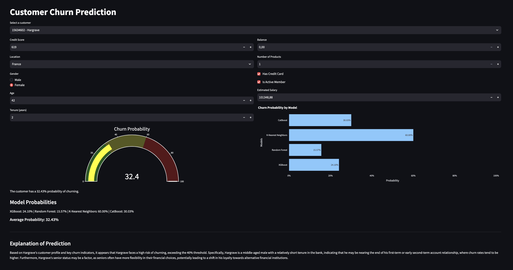

# customer-churn-prediction

## About The Project
End-to-end machine learning pipeline to predict customer churn.<br>
Live Demo: http://54.89.48.203:8501/

<div align="center">
    
</div>

## Major Changes
- Organized the code in different directories
    ```
    root_directory/
    │
    ├──app.py
    ├── utils.py
    ├── data/
    ├── models/
    ├── notebooks/
    ├── prompts/
    ├── README.md
    └── requirements.txt
    ```
- Pre-processing
    - Fitted `StandardScaler` only with the train data
    - Saved fitted scaler to use during inference
- Training
    - Added a `CatBoostClassifier` model
    - Set hyperparmeters for tree-based models
- Inference 
    - Added pre-processing to properly handle inference data
- Prompt Engineering:
    - Simplified and reorganized prompts
    - Provided feature importance values as JSON
- Deployment
    - Deployed Streamlit web app with AWS

## Streamlit Web App deployment via EC2
### Installation
1. Create an EC2 instance in AWS:
    - OS: Ubuntu
    - Instance Type: t2.micro
    - Create a new Key pair to access the instance via SSH

2. Download the `.pem` file amd set permissions:
    ```shell
    chmod 400 <your-key-file.pem>
    ```

3. Connect via SSH
    ```shell
    ssh -i </path/to/your-key-file.pem ubuntu@your-instance-public-ip>
    ```

4. Clone repo
    ```
    git clone https://github.com/matteopilotto/customer-churn-prediction.git
    ```

5. Create a `.env` file in the root directory of the repo and add the Groq api key:
    ```
    GROQ_API_KEY=<your_groq_api_key>
    ```

6. Update sytem, set up Python environment, and install required libraries:
    ```shell
    chmod +x setup.sh
    source setup.sh
    ```

7. Create a new tmux session:
    ```
    tmux new -s streamlit_session
    ```

8. Launch streamlit app:
    ```
    streamlit run app.py --server.address 0.0.0.0 --server.port 8501
    ```

9. To detach from the tmux session press `CTRL+B + D`

10. Access the Stramlit app via the EC2 public IP address:
    ```
    http://<your-ec2-public-ip>:8501
    ```

### Useful Commands:
- To reattach to a tmux session, use the following command:
    ```
    tmux attach -t <your-tmux-session-name>
    ```

- To list the active tmux sessions, use the following command:
    ```
    tmux ls
    ```

- To terminate a tmux session, use the following command:
    ```
    tmux attach -t <your-tmux-session-name>
    ```

## Contributing
### Top contributors:
- [Headstarter.co](https://headstarter.co/)
- Matteo Pilotto